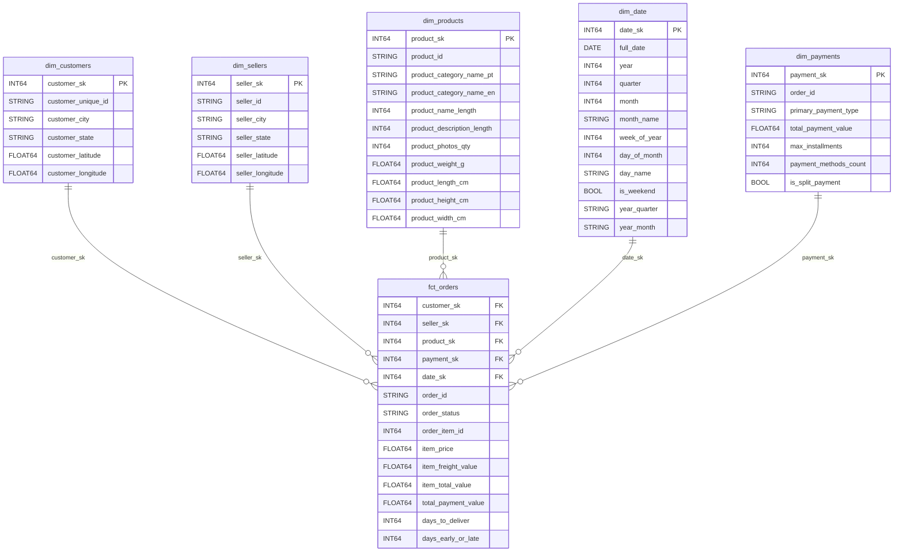

# Entity-Relationship Diagram

Star schema of the Olist Data Warehouse. The fact table sits at the center, connected to five dimension tables.

## Grain

`fct_orders` has a grain of **1 row = 1 item within 1 order**. An order with 3 products generates 3 rows, enabling product-level analysis without losing order-level context.

## Surrogate Keys

All surrogate keys (`_sk`) are generated via `FARM_FINGERPRINT()` — a native BigQuery deterministic hash. This decouples the warehouse from source system IDs and ensures consistent key generation across full refreshes.
